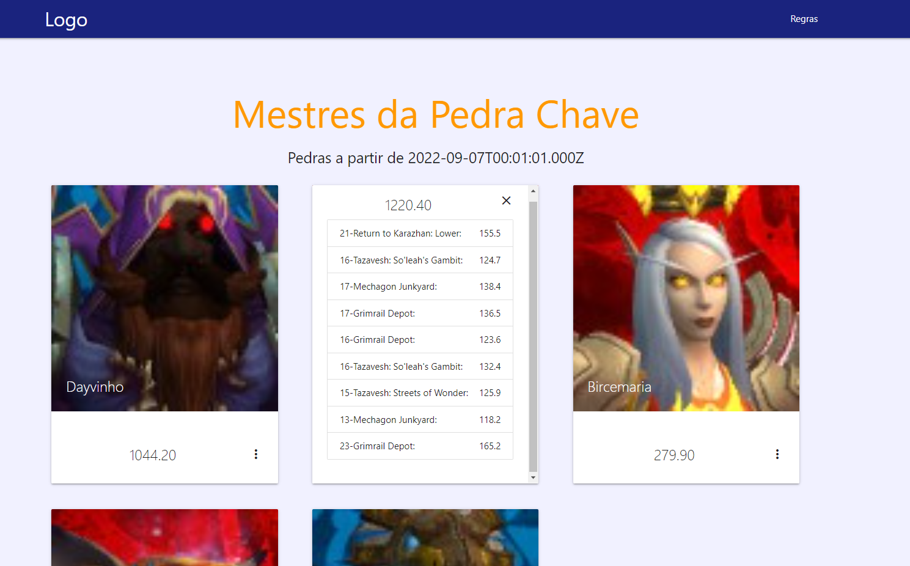

# Mestras da Pedra Chave

Site que calcula a pontuação do campeonato de Mythic Plus realizado na Twitch:
- Daniel Black Belt https://www.twitch.tv/danielblackbelt

## Funcionamento
O site exibe a pontuação dos jogares com base do campo `score` da API do site Raider IO a partir de determinada data e hora informadas na planilha JogadorReino.

- [Planilha JogadorReino](https://docs.google.com/spreadsheets/d/1a0JC-J--zD4qBdt9jAiEucNEGAbl0ppOz82qH1wQ7d4/edit#gid=0)
- [Raider IO](https://raider.io/)
## Planilha JogadorReino

4 campos obrigatórios devem ser preenchidos na planilha JogadorReino

### NomeDoPersonagem	
```
String
```
Exemplo: Shampug

### ReinoDoPersonagem
```
String
```
Exemplo: Stormrage
### Formato da Data: 
```
AAAA-MM-DD
```
Exemplo: 2022-09-23 (23 de Setembro de 2022)

### Formato da Hora 
```
HH:MM:SS
```
Exemplo: 14:30:00 ( 02 horas da tarde GMT-3)

## Detalhamanto
Os resultados são obtidos pela API do raider IO
- [Raider IO](https://raider.io/api#/mythic_plus/getApiV1MythicplusScoretiers)

Eles são calculados obtendo o resultado do campo "mythic_plus_recent_runs" e filtrando por maiores que a data especificada.
Os pontos totais são a soma do campo "score" da dungeons realizada em datas posteriores a data inserida.

## Google Sheets
Para a conexão com o Google Sheets foi utilizado a Google Sheets API descrita no blog [https://benborgers.com/](https://benborgers.com/posts/google-sheets-without-oauth) para extrais os dados da planilha sem uso de autenticação.

Detalhes da API no github: [https://github.com/mikeymckay/google-spreadsheet-javascript](https://github.com/mikeymckay/google-spreadsheet-javascript)

## Screenshots



## Demo

- [https://legendary-granita-b2709c.netlify.app/](https://legendary-granita-b2709c.netlify.app/)

